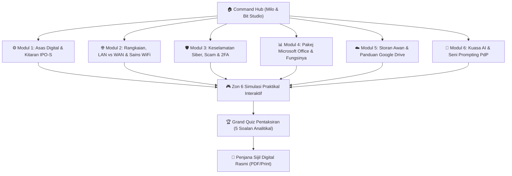

# 🚀 Panduan Lengkap Platform Pembelajaran & Simulasi Interaktif
## "Milo & Bit: The Digital Quest" (Edisi Sekolah Menengah)

Platform ini telah dikemaskini sepenuhnya mengikut tema inspirasi **Milo & Bit (The Code Quest)** dengan visual studio 3D yang ceria, penjelasan topik yang sangat mendalam berserta contoh situasi kehidupan sebenar murid, serta **6 modul simulasi praktikal** untuk kefahaman optimum.

---

## 📂 Lokasi Fail Platform

* 🌐 **Fail Projek Utama (Buka dalam Pelayar Web):** [`E:\antigraviti\CSR\index.html`](file:///E:/antigraviti/CSR/index.html)
* 📄 **Fail Artifak Sistem:** [`misi_teknologi_digital.html`](file:///C:/Users/AZRULNIZAM/.gemini/antigravity/brain/65985b84-9583-4582-8d38-c41404f11ff4/misi_teknologi_digital.html)

---

## 🧭 Struktur 6 Modul Pembelajaran & Perincian Kandungan

---

### 1. ⚙️ Modul 1: Asas Teknologi & Pemprosesan Data
* **Kitaran IPO-S Lengkap:** Masukan (Input) $\rightarrow$ Pemprosesan (Process/CPU) $\rightarrow$ Keluaran (Output/Skrin/Pencetak) $\rightarrow$ Storan (SSD/Cloud).
* **Perbandingan Nyata Hardware vs Software:** Pembahagian peranti masukan, pemproses, keluaran, storan vs Sistem Pengoperasian (OS) dan Perisian Aplikasi.
* **Bahasa Rahsia Komputer (Sistem Biner):** Penerangan konsep suis elektrik 0 dan 1, perbezaan Bit vs Bait (*Byte*), KB, MB, GB berserta **Penterjemah Teks-ke-Biner Interaktif**.

---

### 2. 🌐 Modul 2: Rangkaian Komputer, LAN vs WAN & Sains WiFi
* **Perbezaan Terperinci LAN vs WAN:**
  * **LAN (*Local Area Network*):** Jarak terhad (10m - 1km), kelajuan tinggi, makmal sekolah/rumah, kabel UTP.
  * **WAN (*Wide Area Network*):** Jarak global beribu kilometer, internet, kabel gentian optik dasar laut (*submarine cable*) & satelit.
* **Sains di Sebalik WiFi:** Bagaimana router menukar data biner menjadi gelombang radio elektromagnet, dan perbezaan frekuensi **2.4 GHz** (jarak jauh, tembus dinding) vs **5 GHz** (kelajuan ultra tinggi, jarak dekat).
* **Langkah Demi Langkah Menyambung WiFi:** Buka tetapan $\rightarrow$ Pilih SSID $\rightarrow$ Masukkan kata laluan WPA2 $\rightarrow$ Dapatkan IP DHCP automatik.
* **Perkakasan Rangkaian:** Modem (Penterjemah luar) vs Router (Pengarah trafik/WiFi) vs Switch (Penyambung kabel makmal).

---

### 3. 🛡️ Modul 3: Keselamatan Siber & Pertahanan Identiti Digital
* **Jejak Digital (*Digital Footprint*):** Jejak Aktif (hantaran medsos) vs Pasif (sejarah carian/lokasi GPS).
* **Taktik Scammer & Kejuruteraan Sosial:**
  * **Phishing:** Emel palsu pancingan kata laluan.
  * **Smishing:** SMS cabutan bertuah / parcel palsu.
  * **Vishing:** Panggilan suara Macau Scam / polis palsu.
  * **Quishing:** Pelekat QR code palsu di tempat letak kereta/kedai.
* **Makmal Kata Laluan Kuat & 2FA:** Ujian masa retasan kata laluan dan kepentingan Pengesahan 2 Langkah (*Two-Factor Authentication*).

---

### 4. 📊 Modul 4: Pakej Microsoft Office & Fungsinya
Penerangan terperinci setiap aplikasi disertakan situasi harian murid sekolah:
1. **Microsoft Word (`.docx`):** Pemprosesan teks, surat rasmi persatuan, kertas kerja projek, format *Header/Footer* & *Table of Contents*.
2. **Microsoft Excel (`.xlsx`):** Hamparan elektronik, kiraan markah sukan tahunan, formula `=SUM()`, `=AVERAGE()`, `=IF()`, dan graf bar dinamik.
3. **Microsoft PowerPoint (`.pptx`):** Slaid pembentangan visual projek sains, peraturan 6x6, hierarki visual & *Presenter View*.
4. **Microsoft Access (`.accdb`):** Pengurusan pangkalan data perpustakaan sekolah (10,000 rekod peminjam buku).
5. **Microsoft Outlook & Teams:** Emel rasmi dan bilik darjah maya (*virtual classroom*).

---

### 5. ☁️ Modul 5: Storan Awan (Cloud Storage) & Panduan Google Drive
* **Konsep & Kelebihan Cloud:** Akses dari mana-mana peranti, sandaran automatik, jimat ruang telefon.
* **Tutorial Praktikal Google Drive Langkah Demi Langkah:**
  1. Cara buka dan cipta Folder baharu secara tersusun.
  2. Cara muat naik (*Upload*) fail atau folder (kaedah *Drag & Drop* dan butang *+ New*).
  3. Cara Kongsi Pautan (*Share Link*):
     * **Akses:** *Restricted* vs *Anyone with the link*.
     * **Kebenaran:** *Viewer* (Lihat sahaja), *Commenter* (Ulas), *Editor* (Sunting bersama).

---

### 6. 🤖 Modul 6: Kecerdasan Buatan (AI) & Seni Prompting untuk PdP
* **Apa itu Prompt:** Input arahan teks yang menentukan kualiti respons model AI (*Garbage In, Garbage Out*).
* **5 Bantuan AI dalam PdP:** Ringkasan nota/peta minda, penjanaan kuiz latihan, tutor peribadi 24 jam dengan pelbagai analogi, semakan tatabahasa & penjana idea projek.
* **Formula Rahsia Prompt Lego Burger 4 Lapisan:**
  * 🍔 `[Peranan AI]` + `[Tugasan]` + `[Konteks/Sasaran]` + `[Format Output]`.
* **Bahaya Halusinasi AI:** Kepentingan menyemak silang fakta dengan buku teks rasmi KPM.

---

## 🕹️ 6 Simulasi Praktikal Interaktif

1. ☁️ **Simulasi Google Drive:** Muat naik fail maya, buat folder, dan tetapkan kebenaran pautan *Share Link*.
2. 📡 **Simulasi Sambungan WiFi:** Uji sambungan telefon ke hotspot sekolah dengan kata laluan WPA2 dan alamat IP.
3. 🤖 **Studio Prompt AI PdP:** Pilih blok Lego peranan, tugasan, dan topik untuk menonton simulasi respons tutor AI.
4. 📊 **Padanan Pintar MS Office:** Menilai senario tugasan sekolah dan memilih perisian Office yang paling sesuai.
5. 🕵️ **Pengimbas Scam & Phishing:** Analisis emel amaran palsu dan kesan 3 *Red Flags* utama.
6. 📈 **Kalkulator Live Excel:** Masukkan markah acara sukan sekolah dan saksikan formula `=SUM()`, `=IF()` dan graf bar berubah serta-merta.

---

## 🎖️ Pentaksiran Akhir & Penjana Sijil Murid
* Mengandungi **Grand Quiz 5 Soalan** beraras kognitif tinggi.
* Murid yang tamat boleh menjana **Sijil Digital Rasmi** yang memaparkan Nama Penuh, Nama Sekolah, No Siri Unik dan butang Cetak/Muat Turun PDF.
